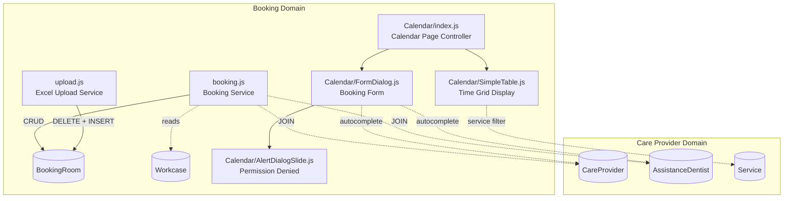

# Booking Domain - Component Diagram

```mermaid
graph TD
    subgraph "Booking Domain"
        BK_Mod[booking.js<br/>Booking Service]
        UL_Mod[upload.js<br/>Excel Upload Service]
        BK_Table[(BookingRoom)]
        WC_Table[(Workcase)]
        
        Cal_UI[Calendar/index.js<br/>Calendar Page Controller]
        ST_UI[Calendar/SimpleTable.js<br/>Time Grid Display]
        FD_UI[Calendar/FormDialog.js<br/>Booking Form]
        AD_UI[Calendar/AlertDialogSlide.js<br/>Permission Denied]
    end

    subgraph "Care Provider Domain"
        CP_Table[(CareProvider)]
        AD_Table[(AssistanceDentist)]
        SV_Table[(Service)]
    end

    BK_Mod -->|CRUD| BK_Table
    BK_Mod -.->|reads| WC_Table
    UL_Mod -->|DELETE + INSERT| BK_Table

    Cal_UI --> ST_UI
    Cal_UI --> FD_UI
    FD_UI --> AD_UI

    BK_Mod -.->|JOIN| CP_Table
    BK_Mod -.->|JOIN| AD_Table
    FD_UI -.->|autocomplete| CP_Table
    FD_UI -.->|autocomplete| AD_Table
    ST_UI -.->|service filter| SV_Table
```
