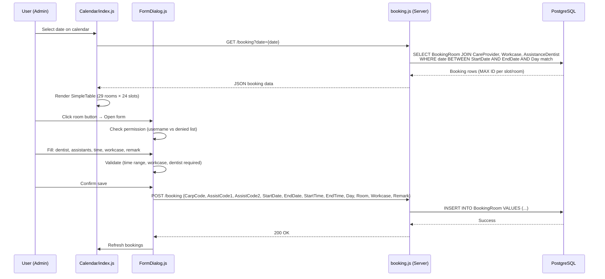

# Booking Domain - Sequence Diagram

```mermaid
sequenceDiagram
    participant User as User (Admin)
    participant CalUI as Calendar/index.js
    participant Form as FormDialog.js
    participant API as booking.js (Server)
    participant DB as PostgreSQL

    User->>CalUI: Select date on calendar
    CalUI->>API: GET /booking?date={date}
    API->>DB: SELECT BookingRoom JOIN CareProvider, Workcase, AssistanceDentist<br/>WHERE date BETWEEN StartDate AND EndDate AND Day match
    DB-->>API: Booking rows (MAX ID per slot/room)
    API-->>CalUI: JSON booking data
    CalUI->>CalUI: Render SimpleTable (29 rooms × 24 slots)

    User->>Form: Click room button → Open form
    Form->>Form: Check permission (username vs denied list)
    User->>Form: Fill: dentist, assistants, time, workcase, remark
    Form->>Form: Validate (time range, workcase, dentist required)
    User->>Form: Confirm save
    Form->>API: POST /booking {CarpCode, AssistCode1, AssistCode2, StartDate, EndDate, StartTime, EndTime, Day, Room, Workcase, Remark}
    API->>DB: INSERT INTO BookingRoom VALUES (...)
    DB-->>API: Success
    API-->>Form: 200 OK
    Form->>CalUI: Refresh bookings
```
