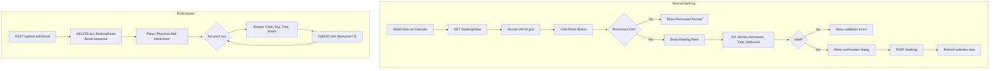

# Booking Domain - Workflow Diagram

```mermaid
flowchart TD
    subgraph "Manual Booking"
        SelectDate[Select Date on Calendar] --> FetchBookings[GET /booking?date]
        FetchBookings --> RenderGrid[Render 29×24 grid]
        RenderGrid --> ClickRoom[Click Room Button]
        ClickRoom --> PermCheck{Permission OK?}
        PermCheck -->|No| DeniedDialog[Show Permission Denied]
        PermCheck -->|Yes| ShowForm[Show Booking Form]
        ShowForm --> FillForm[Fill: Dentist, Assistants, Time, Workcase]
        FillForm --> Validate{Valid?}
        Validate -->|No| ShowErrors[Show validation errors]
        Validate -->|Yes| Confirm[Show confirmation dialog]
        Confirm --> Save[POST /booking]
        Save --> Refresh[Refresh calendar data]
    end

    subgraph "Excel Import"
        Upload[POST /upload with Excel] --> ClearAll[DELETE ALL BookingRoom<br/>Reset sequence]
        ClearAll --> ParseSheet[Parse 'Physician Slot Worksheet']
        ParseSheet --> LoopRows{For each row}
        LoopRows --> ExtractData[Extract: Code, Day, Time, Room]
        ExtractData --> InsertRow[INSERT with Workcase='N']
        InsertRow --> LoopRows
    end
```
