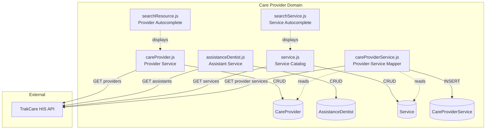

# Care Provider Domain - Component Diagram

```mermaid
graph TD
    subgraph "Care Provider Domain"
        CP_Mod[careProvider.js<br/>Provider Service]
        AD_Mod[assistanceDentist.js<br/>Assistant Service]
        SV_Mod[service.js<br/>Service Catalog]
        CPS_Mod[careProviderService.js<br/>Provider-Service Mapper]

        CP_Table[(CareProvider)]
        AD_Table[(AssistanceDentist)]
        SV_Table[(Service)]
        CPS_Table[(CareProviderService)]

        SearchRes[searchResource.js<br/>Provider Autocomplete]
        SearchSvc[searchService.js<br/>Service Autocomplete]
    end

    subgraph "External"
        TrakCare[TrakCare HIS API]
    end

    CP_Mod -->|CRUD| CP_Table
    AD_Mod -->|CRUD| AD_Table
    SV_Mod -->|CRUD| SV_Table
    CPS_Mod -->|INSERT| CPS_Table
    CPS_Mod -.->|reads| CP_Table
    CPS_Mod -.->|reads| SV_Table

    CP_Mod -->|GET providers| TrakCare
    AD_Mod -->|GET assistants| TrakCare
    SV_Mod -->|GET services| TrakCare
    CPS_Mod -->|GET provider services| TrakCare

    SearchRes -.->|displays| CP_Mod
    SearchSvc -.->|displays| SV_Mod
```
