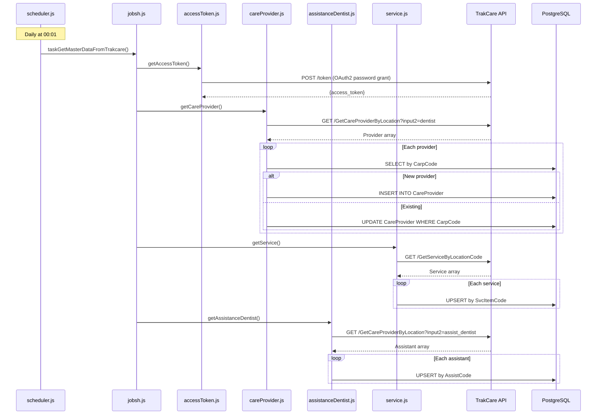

# Care Provider Domain - Sequence Diagram

```mermaid
sequenceDiagram
    participant Scheduler as scheduler.js
    participant JobSH as jobsh.js
    participant AccessToken as accessToken.js
    participant CareProvider as careProvider.js
    participant AssistDentist as assistanceDentist.js
    participant ServiceMod as service.js
    participant TrakCare as TrakCare API
    participant DB as PostgreSQL

    Note over Scheduler: Daily at 00:01
    Scheduler->>JobSH: taskGetMasterDataFromTrakcare()
    JobSH->>AccessToken: getAccessToken()
    AccessToken->>TrakCare: POST /token (OAuth2 password grant)
    TrakCare-->>AccessToken: {access_token}

    JobSH->>CareProvider: getCareProvider()
    CareProvider->>TrakCare: GET /GetCareProviderByLocation?input2=dentist
    TrakCare-->>CareProvider: Provider array
    loop Each provider
        CareProvider->>DB: SELECT by CarpCode
        alt New provider
            CareProvider->>DB: INSERT INTO CareProvider
        else Existing
            CareProvider->>DB: UPDATE CareProvider WHERE CarpCode
        end
    end

    JobSH->>ServiceMod: getService()
    ServiceMod->>TrakCare: GET /GetServiceByLocationCode
    TrakCare-->>ServiceMod: Service array
    loop Each service
        ServiceMod->>DB: UPSERT by SvcItemCode
    end

    JobSH->>AssistDentist: getAssistanceDentist()
    AssistDentist->>TrakCare: GET /GetCareProviderByLocation?input2=assist_dentist
    TrakCare-->>AssistDentist: Assistant array
    loop Each assistant
        AssistDentist->>DB: UPSERT by AssistCode
    end
```
