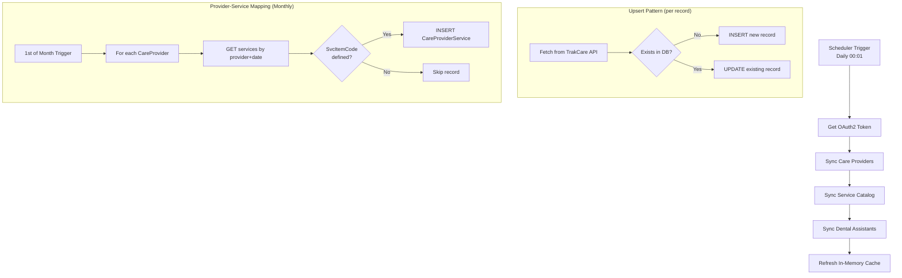

# Care Provider Domain - Workflow Diagram

```mermaid
flowchart TD
    Start[Scheduler Trigger<br/>Daily 00:01] --> GetToken[Get OAuth2 Token]
    GetToken --> SyncProviders[Sync Care Providers]
    SyncProviders --> SyncServices[Sync Service Catalog]
    SyncServices --> SyncAssistants[Sync Dental Assistants]
    SyncAssistants --> RefreshCache[Refresh In-Memory Cache]

    subgraph "Upsert Pattern (per record)"
        Fetch[Fetch from TrakCare API] --> Check{Exists in DB?}
        Check -->|No| Insert[INSERT new record]
        Check -->|Yes| Update[UPDATE existing record]
    end

    subgraph "Provider-Service Mapping (Monthly)"
        Monthly[1st of Month Trigger] --> ForEachProvider[For each CareProvider]
        ForEachProvider --> FetchServices[GET services by provider+date]
        FetchServices --> ValidateCode{SvcItemCode<br/>defined?}
        ValidateCode -->|Yes| InsertMapping[INSERT CareProviderService]
        ValidateCode -->|No| SkipRecord[Skip record]
    end
```
