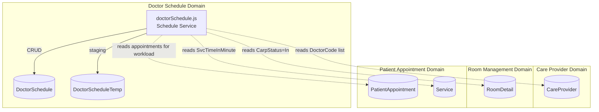

# Doctor Schedule Domain - Component Diagram

```mermaid
graph TD
    subgraph "Doctor Schedule Domain"
        DS_Mod[doctorSchedule.js<br/>Schedule Service]
        DS_Table[(DoctorSchedule)]
        DS_Temp[(DoctorScheduleTemp)]
    end

    subgraph "Care Provider Domain"
        CP_Table[(CareProvider)]
    end

    subgraph "Room Management Domain"
        RD_Table[(RoomDetail)]
    end

    subgraph "Patient Appointment Domain"
        PA_Table[(PatientAppointment)]
        SV_Table[(Service)]
    end

    DS_Mod -->|CRUD| DS_Table
    DS_Mod -->|staging| DS_Temp
    DS_Mod -.->|reads DoctorCode list| CP_Table
    DS_Mod -.->|reads CarpStatus=In| RD_Table
    DS_Mod -.->|reads appointments for workload| PA_Table
    DS_Mod -.->|reads SvcTimeInMinute| SV_Table
```
