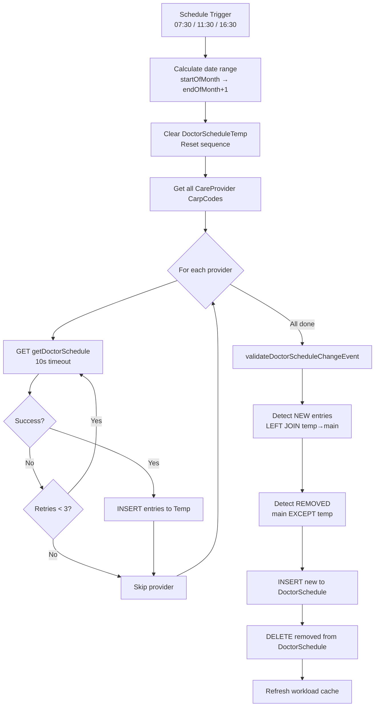

# Doctor Schedule Domain - Workflow Diagram

```mermaid
flowchart TD
    Trigger[Schedule Trigger<br/>07:30 / 11:30 / 16:30] --> CalcRange[Calculate date range<br/>startOfMonth → endOfMonth+1]
    CalcRange --> ClearTemp[Clear DoctorScheduleTemp<br/>Reset sequence]
    ClearTemp --> FetchProviders[Get all CareProvider CarpCodes]
    FetchProviders --> LoopProviders{For each provider}
    LoopProviders --> CallAPI[GET getDoctorSchedule<br/>10s timeout]
    CallAPI --> APIResult{Success?}
    APIResult -->|Yes| InsertTemp[INSERT entries to Temp]
    APIResult -->|No| Retry{Retries < 3?}
    Retry -->|Yes| CallAPI
    Retry -->|No| NextProvider[Skip provider]
    InsertTemp --> NextProvider
    NextProvider --> LoopProviders
    LoopProviders -->|All done| Validate[validateDoctorScheduleChangeEvent]
    Validate --> DetectNew[Detect NEW entries<br/>LEFT JOIN temp→main]
    DetectNew --> DetectRemoved[Detect REMOVED<br/>main EXCEPT temp]
    DetectRemoved --> ApplyNew[INSERT new to DoctorSchedule]
    ApplyNew --> DeleteRemoved[DELETE removed from DoctorSchedule]
    DeleteRemoved --> RefreshWorkload[Refresh workload cache]
```
