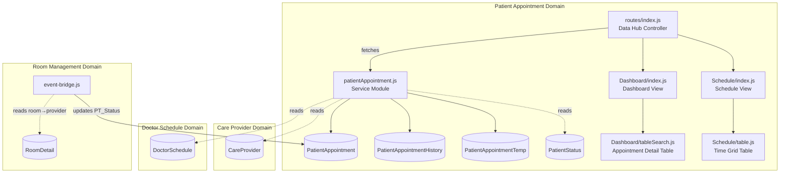

# Patient Appointment Domain - Component Diagram

```mermaid
graph TD
    subgraph "Patient Appointment Domain"
        PA_Module[patientAppointment.js<br/>Service Module]
        PA_Table[(PatientAppointment)]
        PA_History[(PatientAppointmentHistory)]
        PA_Temp[(PatientAppointmentTemp)]
        PA_Status[(PatientStatus)]
        
        Dashboard_UI[Dashboard/index.js<br/>Dashboard View]
        Schedule_UI[Schedule/index.js<br/>Schedule View]
        TableSearch[Dashboard/tableSearch.js<br/>Appointment Detail Table]
        ScheduleTable[Schedule/table.js<br/>Time Grid Table]
        Routes_UI[routes/index.js<br/>Data Hub Controller]
    end

    subgraph "Care Provider Domain"
        CP_Table[(CareProvider)]
    end

    subgraph "Doctor Schedule Domain"
        DS_Table[(DoctorSchedule)]
    end

    subgraph "Room Management Domain"
        RD_Table[(RoomDetail)]
        EventBridge[event-bridge.js]
    end

    PA_Module --> PA_Table
    PA_Module --> PA_History
    PA_Module --> PA_Temp
    PA_Module -.->|reads| PA_Status
    PA_Module -.->|reads| CP_Table
    PA_Module -.->|reads| DS_Table

    EventBridge -->|updates PT_Status| PA_Table
    EventBridge -.->|reads room→provider| RD_Table

    Routes_UI -->|fetches| PA_Module
    Routes_UI --> Dashboard_UI
    Routes_UI --> Schedule_UI
    Dashboard_UI --> TableSearch
    Schedule_UI --> ScheduleTable
```
