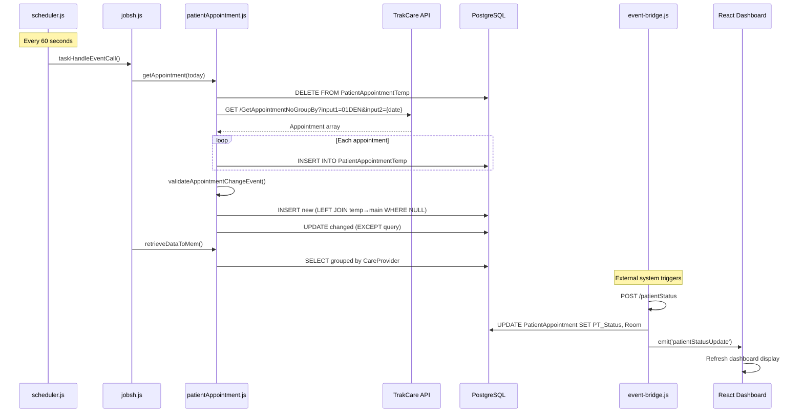

# Patient Appointment Domain - Sequence Diagram

## Primary Workflow: Appointment Sync and Status Update

```mermaid
sequenceDiagram
    participant Scheduler as scheduler.js
    participant JobSH as jobsh.js
    participant PatAppt as patientAppointment.js
    participant TrakCare as TrakCare API
    participant DB as PostgreSQL
    participant EventBridge as event-bridge.js
    participant Frontend as React Dashboard

    Note over Scheduler: Every 60 seconds
    Scheduler->>JobSH: taskHandleEventCall()
    JobSH->>PatAppt: getAppointment(today)
    PatAppt->>DB: DELETE FROM PatientAppointmentTemp
    PatAppt->>TrakCare: GET /GetAppointmentNoGroupBy?input1=01DEN&input2={date}
    TrakCare-->>PatAppt: Appointment array
    loop Each appointment
        PatAppt->>DB: INSERT INTO PatientAppointmentTemp
    end
    PatAppt->>PatAppt: validateAppointmentChangeEvent()
    PatAppt->>DB: INSERT new (LEFT JOIN temp→main WHERE NULL)
    PatAppt->>DB: UPDATE changed (EXCEPT query)
    JobSH->>PatAppt: retrieveDataToMem()
    PatAppt->>DB: SELECT grouped by CareProvider

    Note over EventBridge: External system triggers
    EventBridge->>EventBridge: POST /patientStatus
    EventBridge->>DB: UPDATE PatientAppointment SET PT_Status, Room
    EventBridge->>Frontend: emit('patientStatusUpdate')
    Frontend->>Frontend: Refresh dashboard display
```
