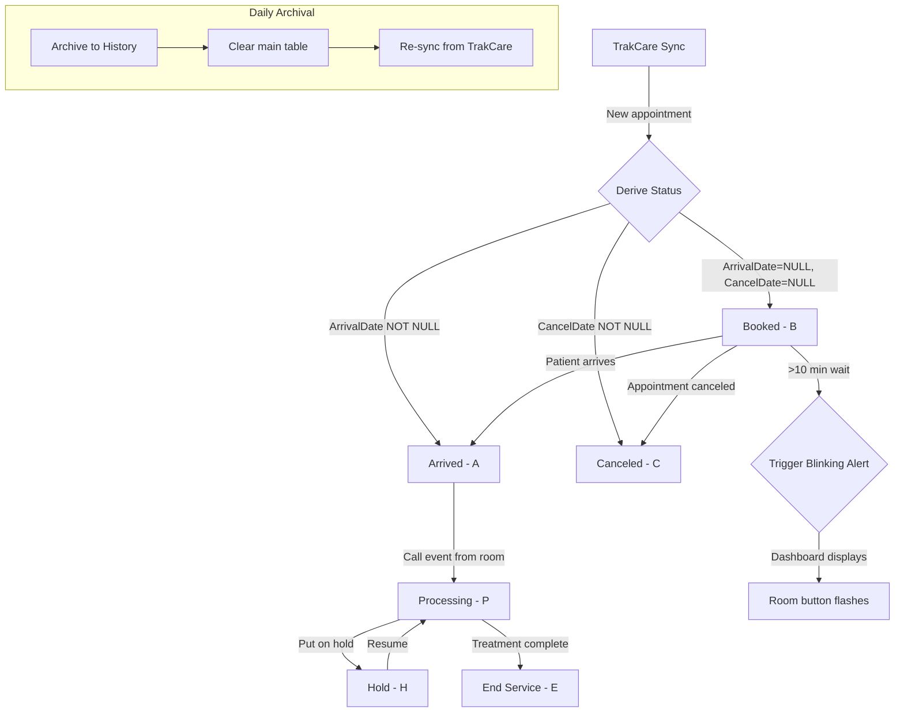
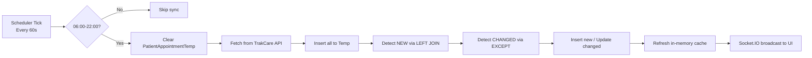

# Patient Appointment Domain - Workflow Diagram

## Patient Status Lifecycle

```mermaid
flowchart TD
    A[TrakCare Sync] -->|New appointment| B{Derive Status}
    B -->|ArrivalDate=NULL, CancelDate=NULL| C[Booked - B]
    B -->|ArrivalDate NOT NULL| D[Arrived - A]
    B -->|CancelDate NOT NULL| E[Canceled - C]
    
    C -->|Patient arrives| D
    C -->|Appointment canceled| E
    D -->|Call event from room| F[Processing - P]
    F -->|Put on hold| G[Hold - H]
    G -->|Resume| F
    F -->|Treatment complete| H[End Service - E]
    
    C -->|>10 min wait| I{Trigger Blinking Alert}
    I -->|Dashboard displays| J[Room button flashes]

    subgraph "Daily Archival"
        K[Archive to History] --> L[Clear main table] --> M[Re-sync from TrakCare]
    end
```

## Appointment Sync Cycle

```mermaid
flowchart LR
    Start[Scheduler Tick<br/>Every 60s] --> TimeCheck{06:00-22:00?}
    TimeCheck -->|No| Skip[Skip sync]
    TimeCheck -->|Yes| ClearTemp[Clear PatientAppointmentTemp]
    ClearTemp --> FetchAPI[Fetch from TrakCare API]
    FetchAPI --> InsertTemp[Insert all to Temp]
    InsertTemp --> DetectNew[Detect NEW via LEFT JOIN]
    DetectNew --> DetectChanged[Detect CHANGED via EXCEPT]
    DetectChanged --> ApplyChanges[Insert new / Update changed]
    ApplyChanges --> RefreshMem[Refresh in-memory cache]
    RefreshMem --> NotifyUI[Socket.IO broadcast to UI]
```
