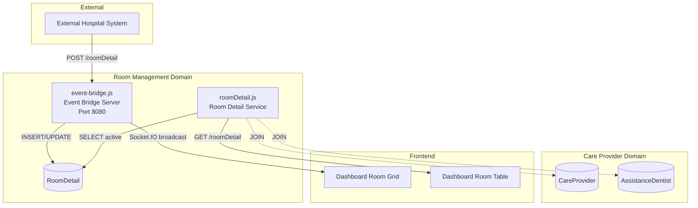

# Room Management Domain - Component Diagram

```mermaid
graph TD
    subgraph "Room Management Domain"
        EB[event-bridge.js<br/>Event Bridge Server<br/>Port 8080]
        RD_Mod[roomDetail.js<br/>Room Detail Service]
        RD_Table[(RoomDetail)]
    end

    subgraph "Care Provider Domain"
        CP_Table[(CareProvider)]
        AD_Table[(AssistanceDentist)]
    end

    subgraph "External"
        ExtSys[External Hospital System]
    end

    subgraph "Frontend"
        DashGrid[Dashboard Room Grid]
        DashTable[Dashboard Room Table]
    end

    ExtSys -->|POST /roomDetail| EB
    EB -->|INSERT/UPDATE| RD_Table
    RD_Mod -->|SELECT active| RD_Table
    RD_Mod -.->|JOIN| CP_Table
    RD_Mod -.->|JOIN| AD_Table
    EB -->|Socket.IO broadcast| DashGrid
    RD_Mod -->|GET /roomDetail| DashTable
```
