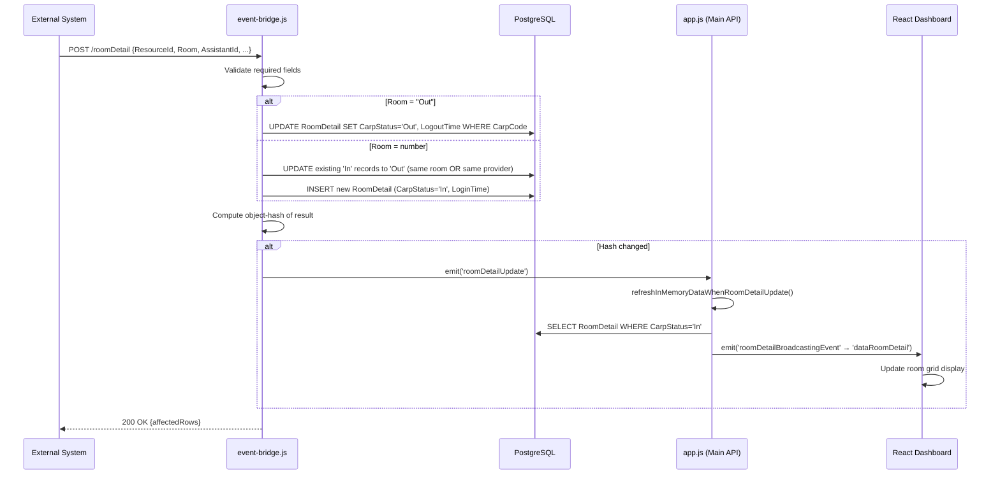

# Room Management Domain - Sequence Diagram

```mermaid
sequenceDiagram
    participant External as External System
    participant EB as event-bridge.js
    participant DB as PostgreSQL
    participant MainAPI as app.js (Main API)
    participant Frontend as React Dashboard

    External->>EB: POST /roomDetail {ResourceId, Room, AssistantId, ...}
    EB->>EB: Validate required fields
    
    alt Room = "Out"
        EB->>DB: UPDATE RoomDetail SET CarpStatus='Out', LogoutTime WHERE CarpCode
    else Room = number
        EB->>DB: UPDATE existing 'In' records to 'Out' (same room OR same provider)
        EB->>DB: INSERT new RoomDetail (CarpStatus='In', LoginTime)
    end

    EB->>EB: Compute object-hash of result
    alt Hash changed
        EB->>MainAPI: emit('roomDetailUpdate')
        MainAPI->>MainAPI: refreshInMemoryDataWhenRoomDetailUpdate()
        MainAPI->>DB: SELECT RoomDetail WHERE CarpStatus='In'
        MainAPI->>Frontend: emit('roomDetailBroadcastingEvent' → 'dataRoomDetail')
        Frontend->>Frontend: Update room grid display
    end
    
    EB-->>External: 200 OK {affectedRows}
```
