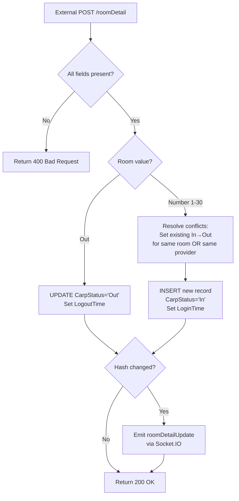

# Room Management Domain - Workflow Diagram

```mermaid
flowchart TD
    Start[External POST /roomDetail] --> Validate{All fields present?}
    Validate -->|No| Error400[Return 400 Bad Request]
    Validate -->|Yes| CheckRoom{Room value?}
    
    CheckRoom -->|"Out"| LogOut[UPDATE CarpStatus='Out'<br/>Set LogoutTime]
    CheckRoom -->|Number 1-30| ConflictRes[Resolve conflicts:<br/>Set existing In→Out<br/>for same room OR same provider]
    ConflictRes --> LogIn[INSERT new record<br/>CarpStatus='In'<br/>Set LoginTime]
    
    LogOut --> Hash{Hash changed?}
    LogIn --> Hash
    Hash -->|No| Return200[Return 200 OK]
    Hash -->|Yes| Broadcast[Emit roomDetailUpdate<br/>via Socket.IO]
    Broadcast --> Return200
```
