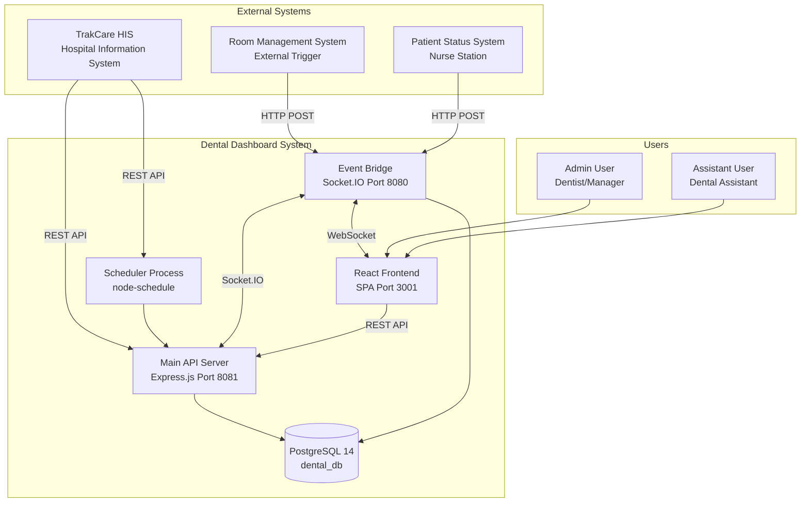
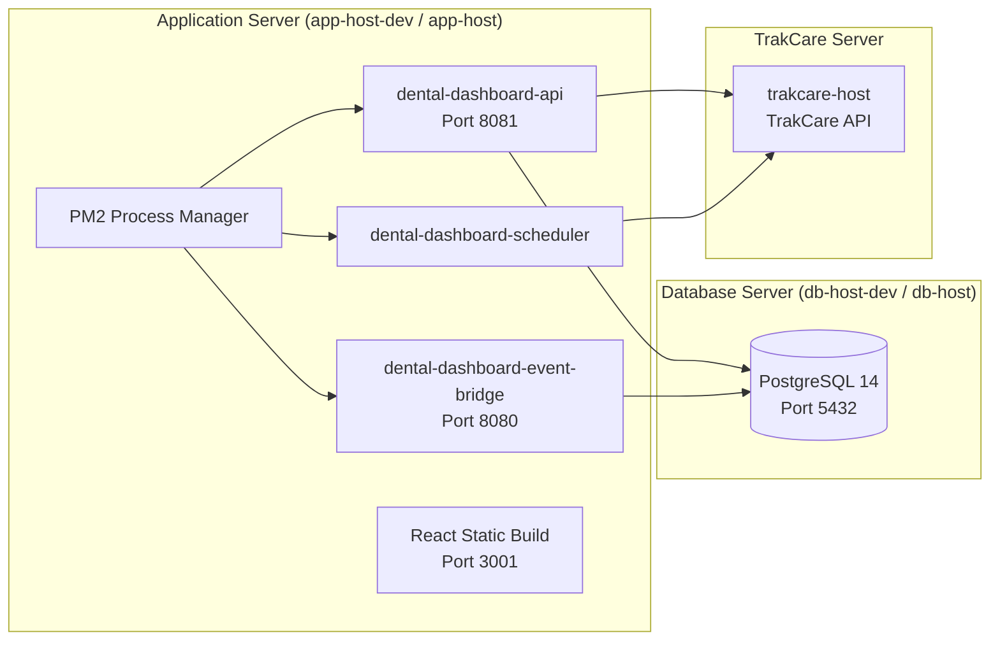

# Architecture Diagrams

## System Context Diagram

```mermaid
graph TB
    subgraph "External Systems"
        TrakCare[TrakCare HIS<br/>Hospital Information System]
        ExtRoom[Room Management System<br/>External Trigger]
        ExtPatient[Patient Status System<br/>Nurse Station]
    end

    subgraph "Dental Dashboard System"
        MainAPI[Main API Server<br/>Express.js Port 8081]
        EventBridge[Event Bridge<br/>Socket.IO Port 8080]
        Scheduler[Scheduler Process<br/>node-schedule]
        Frontend[React Frontend<br/>SPA Port 3001]
        DB[(PostgreSQL 14<br/>dental_db)]
    end

    subgraph "Users"
        Admin[Admin User<br/>Dentist/Manager]
        Assistant[Assistant User<br/>Dental Assistant]
    end

    TrakCare -->|REST API| MainAPI
    TrakCare -->|REST API| Scheduler
    ExtRoom -->|HTTP POST| EventBridge
    ExtPatient -->|HTTP POST| EventBridge
    
    MainAPI --> DB
    EventBridge --> DB
    Scheduler --> MainAPI
    
    EventBridge <-->|Socket.IO| MainAPI
    EventBridge <-->|WebSocket| Frontend
    
    Frontend -->|REST API| MainAPI
    Admin --> Frontend
    Assistant --> Frontend
```

## Deployment Architecture

```mermaid
graph LR
    subgraph "Application Server (app-host-dev / app-host)"
        PM2[PM2 Process Manager]
        API[dental-dashboard-api<br/>Port 8081]
        EB[dental-dashboard-event-bridge<br/>Port 8080]
        SCH[dental-dashboard-scheduler]
        React[React Static Build<br/>Port 3001]
    end

    subgraph "Database Server (db-host-dev / db-host)"
        PG[(PostgreSQL 14<br/>Port 5432)]
    end

    subgraph "TrakCare Server"
        TC[trakcare-host<br/>TrakCare API]
    end

    PM2 --> API
    PM2 --> EB
    PM2 --> SCH
    API --> PG
    EB --> PG
    API --> TC
    SCH --> TC
```
