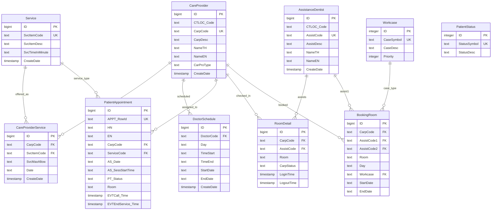

# Class / ER Diagrams

## Entity Relationship Diagram

```mermaid
erDiagram
    CareProvider {
        bigint ID PK
        text CTLOC_Code
        text CarpCode UK
        text CarpDesc
        text NameTH
        text NameEN
        text CarProType
        timestamp CreateDate
    }

    AssistanceDentist {
        bigint ID PK
        text CTLOC_Code
        text AssistCode UK
        text AssistDesc
        text NameTH
        text NameEN
        timestamp CreateDate
    }

    Service {
        bigint ID PK
        text SvcItemCode UK
        text SvcItemDesc
        text SvcTimeInMinute
        timestamp CreateDate
    }

    CareProviderService {
        bigint ID PK
        text CarpCode FK
        text SvcItemCode FK
        text SvcMaxAllow
        text Date
        timestamp CreateDate
    }

    DoctorSchedule {
        bigint ID PK
        text DoctorCode FK
        text Day
        text TimeStart
        text TimeEnd
        text StartDate
        text EndDate
        timestamp CreateDate
    }

    PatientAppointment {
        bigint ID PK
        text APPT_RowId UK
        text HN
        text EN
        text CarpCode FK
        text ServiceCode FK
        text AS_Date
        text AS_SessStartTime
        text PT_Status
        text Room
        timestamp EVTCall_Time
        timestamp EVTEndService_Time
    }

    RoomDetail {
        bigint ID PK
        text CarpCode FK
        text AssistCode FK
        text Room
        text CarpStatus
        timestamp LoginTime
        timestamp LogoutTime
    }

    BookingRoom {
        bigint ID PK
        text CarpCode FK
        text AssistCode1 FK
        text AssistCode2 FK
        text Room
        text Day
        text Workcase FK
        text StartDate
        text EndDate
    }

    Workcase {
        integer ID PK
        text CaseSymbol UK
        text CaseDesc
        integer Priority
    }

    PatientStatus {
        integer ID PK
        text StatusSymbol UK
        text StatusDesc
    }

    CareProvider ||--o{ CareProviderService : "provides"
    Service ||--o{ CareProviderService : "offered_as"
    CareProvider ||--o{ DoctorSchedule : "scheduled"
    CareProvider ||--o{ PatientAppointment : "assigned_to"
    Service ||--o{ PatientAppointment : "service_type"
    CareProvider ||--o{ RoomDetail : "checked_in"
    AssistanceDentist ||--o{ RoomDetail : "assists"
    CareProvider ||--o{ BookingRoom : "booked"
    AssistanceDentist ||--o{ BookingRoom : "assist1"
    Workcase ||--o{ BookingRoom : "case_type"
```
