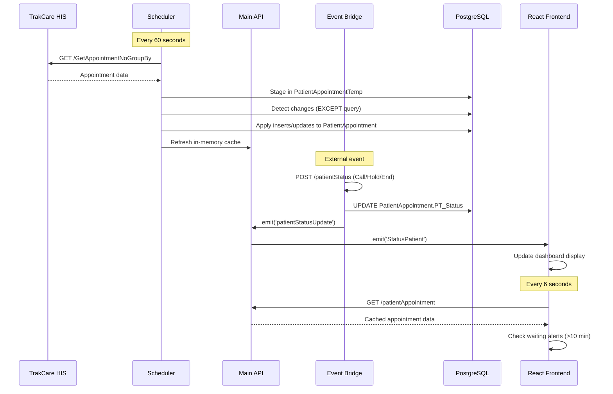
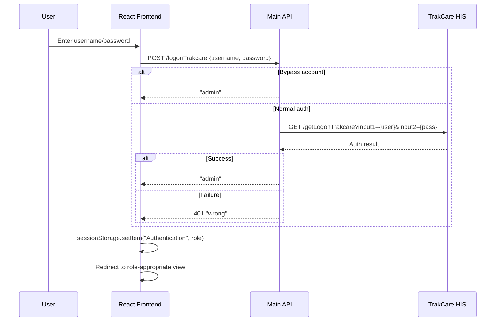
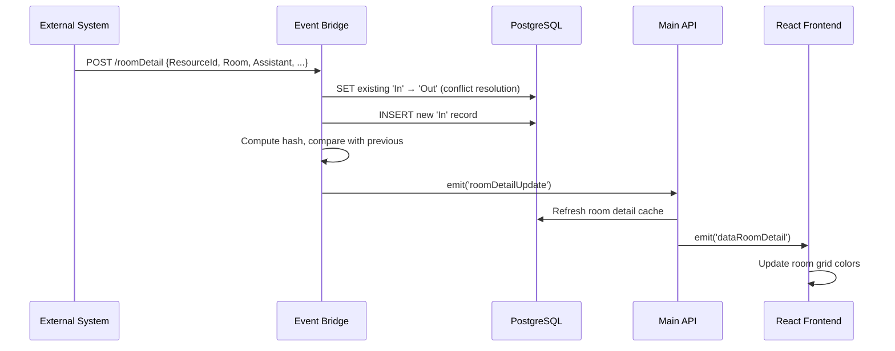

# Sequence Diagrams

## Main Data Flow: Appointment Lifecycle

```mermaid
sequenceDiagram
    participant TC as TrakCare HIS
    participant SCH as Scheduler
    participant API as Main API
    participant EB as Event Bridge
    participant DB as PostgreSQL
    participant FE as React Frontend

    Note over SCH: Every 60 seconds
    SCH->>TC: GET /GetAppointmentNoGroupBy
    TC-->>SCH: Appointment data
    SCH->>DB: Stage in PatientAppointmentTemp
    SCH->>DB: Detect changes (EXCEPT query)
    SCH->>DB: Apply inserts/updates to PatientAppointment
    SCH->>API: Refresh in-memory cache

    Note over EB: External event
    EB->>EB: POST /patientStatus (Call/Hold/End)
    EB->>DB: UPDATE PatientAppointment.PT_Status
    EB->>API: emit('patientStatusUpdate')
    API->>FE: emit('StatusPatient')
    FE->>FE: Update dashboard display

    Note over FE: Every 6 seconds
    FE->>API: GET /patientAppointment
    API-->>FE: Cached appointment data
    FE->>FE: Check waiting alerts (>10 min)
```

## Authentication Flow

```mermaid
sequenceDiagram
    participant User
    participant FE as React Frontend
    participant API as Main API
    participant TC as TrakCare HIS

    User->>FE: Enter username/password
    FE->>API: POST /logonTrakcare {username, password}
    
    alt Bypass account
        API-->>FE: "admin"
    else Normal auth
        API->>TC: GET /getLogonTrakcare?input1={user}&input2={pass}
        TC-->>API: Auth result
        alt Success
            API-->>FE: "admin"
        else Failure
            API-->>FE: 401 "wrong"
        end
    end

    FE->>FE: sessionStorage.setItem("Authentication", role)
    FE->>FE: Redirect to role-appropriate view
```

## Room Assignment Flow

```mermaid
sequenceDiagram
    participant Ext as External System
    participant EB as Event Bridge
    participant DB as PostgreSQL
    participant API as Main API
    participant FE as React Frontend

    Ext->>EB: POST /roomDetail {ResourceId, Room, Assistant, ...}
    EB->>DB: SET existing 'In' → 'Out' (conflict resolution)
    EB->>DB: INSERT new 'In' record
    EB->>EB: Compute hash, compare with previous
    EB->>API: emit('roomDetailUpdate')
    API->>DB: Refresh room detail cache
    API->>FE: emit('dataRoomDetail')
    FE->>FE: Update room grid colors
```
